<div align="center">
  
</div>

<h1 align="center">spring-rs Plugin for RustRover</h1>

<div align="center">
  IDE support for the <a href="https://github.com/spring-rs/spring-rs">spring-rs</a> framework — an application framework written in Rust, inspired by Java's SpringBoot
</div>

<div align="center">
  <b>English</b> ｜ <a href="README_zh.md">中文</a>
</div>

<div align="center">
  <a href="https://plugins.jetbrains.com/"></a>
  <a href="LICENSE"></a>
</div>

<br/>

## Features

- **New Project Wizard** - Create spring-rs projects with plugin selection, example code generation, and crates.io dependency search
- **Sea-ORM Code Generation** - Generate Entity/DTO/VO/Service/Route layers from database tables with multi-table mode, column customization, foreign key definition, template groups, type mapping, and live preview
- **TOML Configuration Support** - Smart completion, validation, navigation, and documentation for `app.toml` config files
- **Environment Variable Support** - Auto-completion, validation, documentation, and navigation for `${VAR}` references in TOML
- **Search Everywhere** - Global search for HTTP routes, scheduled jobs, stream listeners, and components
- **Unified Tool Window** - Browse all spring-rs items: Endpoints, Jobs, Stream Listeners, Components, Configurations, Plugins
- **Gutter Line Markers** - Visual icons for routes, jobs, stream listeners, cache, sa-token, Socket.IO, middlewares
- **Route Conflict Detection** - Cross-file duplicate route detection with click-to-navigate QuickFix
- **`#[auto_config]` Completion** - Auto-complete configurator types (`WebConfigurator`, `JobConfigurator`)
- **Dependency Injection Validation** - Validates `#[inject(component)]` types with framework component whitelist
- **Run Configuration** - Dedicated spring-rs run configuration with custom icons
- **JSON to Rust Struct** - Convert JSON to Rust struct definitions with serde attributes
- **Custom Icons** - spring-rs themed icons for config files

## Requirements

- RustRover 2025.1+ or IntelliJ IDEA 2023.3+ with the Rust plugin installed
- A Rust project using `spring-rs` dependencies

## Installation

1. Open your IDE and go to **Settings/Preferences** > **Plugins**
2. Click **Marketplace** and search for "spring-rs"
3. Click **Install** and restart your IDE

Or install manually:
1. Download the plugin ZIP from [Releases](https://github.com/spring-rs/spring-rs-plugin/releases)
2. Go to **Settings/Preferences** > **Plugins** > **Gear icon** > **Install Plugin from Disk...**
3. Select the downloaded ZIP file

---

## Search Everywhere

Double-press **Shift** to open Search Everywhere, then search for spring-rs items across your entire project.

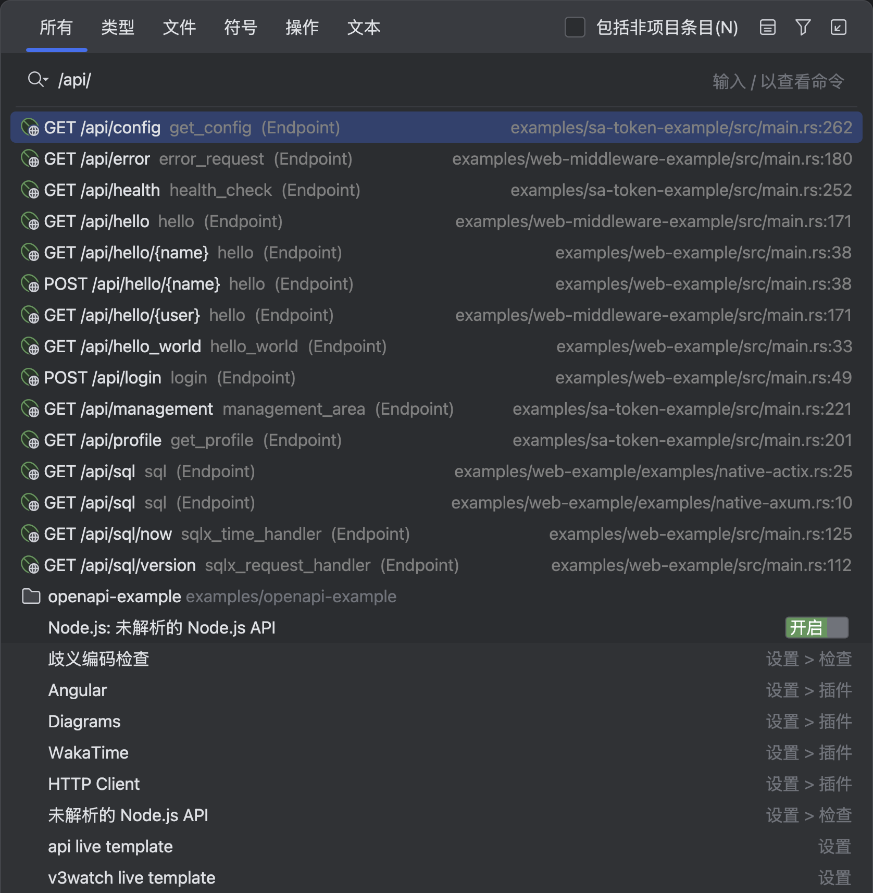

Supported item types:
- **HTTP Routes** — Search by path (e.g., `/api/users`) or handler name
- **Scheduled Jobs** — Search by function name; displays cron/delay/rate expression
- **Stream Listeners** — Search by topic name
- **Components** — Search for Service, Configuration, and Plugin definitions

Each result shows an icon, name, details, and type badge. Click to navigate directly to the source code.

---

## TOML Configuration Support

The plugin provides comprehensive IDE support for spring-rs configuration files (`app.toml`, `app-dev.toml`, `app-prod.toml`, etc.).

### Smart Completion

Auto-complete section names, keys, and values based on Rust struct definitions annotated with `#[derive(Configurable)]` `#[config_prefix = "xxx"]`.


### Enum Value Completion

Enum fields show all available variants from the Rust enum definition.


### Navigation

**Ctrl+Click** (or **Cmd+Click** on macOS) on any TOML key or section to jump directly to the corresponding Rust struct field.


### Validation

Real-time inspections for:
- Unknown sections
- Unknown keys
- Type mismatches (e.g., string where integer expected)
- Invalid enum values


Quick-fixes are available for common issues:
- Add/remove quotes
- Wrap value in array
- Convert to inline table


### Documentation

Hover over any TOML key or section (**Ctrl+Q** / **F1**) to see:
- Field type
- Default value
- Doc comments from Rust source
- Possible enum values


---

## Environment Variable Support

Full IDE support for `${VAR}` and `${VAR:default}` environment variable references in TOML configuration files.

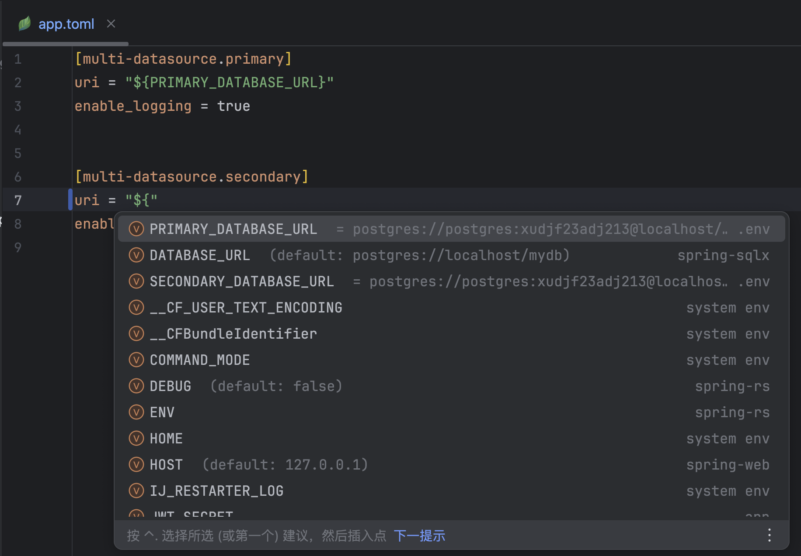

### Auto-Completion

Type `${` in a TOML value to get suggestions from multiple sources (in priority order):
1. **`.env` files** — Variables defined in `.env` at crate root and workspace root
2. **Already-used variables** — Variables referenced in other TOML config files
3. **spring-rs known variables** — `SPRING_ENV`, `DATABASE_URL`, `REDIS_URL`, `HOST`, `PORT`, `LOG_LEVEL`, `RUST_LOG`, `MAIL_*`, `STREAM_URI`, `OTEL_*`, etc.
4. **System environment** — All system environment variables

### Validation

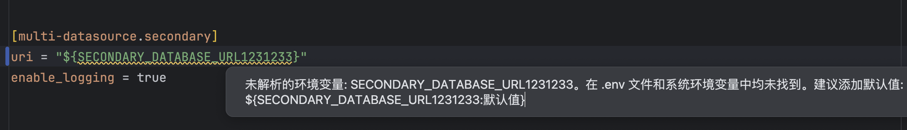

- Warning for undefined variables (not in `.env` or system env)
- No warning if a default value is provided (`${VAR:fallback}`)
- Error for malformed references (empty name, invalid characters)

### Documentation

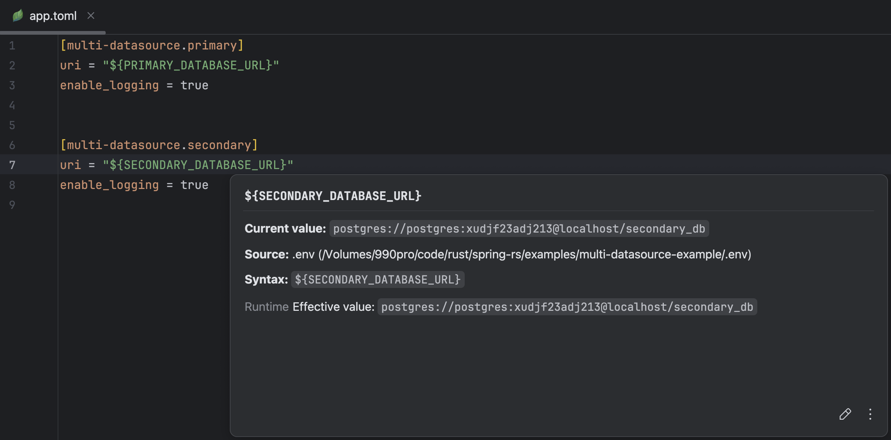

Hover over `${VAR}` (**Ctrl+Q**) to see:
- Variable name
- Current value (from system env or `.env` file)
- Default value (if specified)
- Source (`.env` file path or "system environment")

### Navigation

**Ctrl+Click** on `${VAR_NAME}` to jump to the variable definition in your `.env` file.

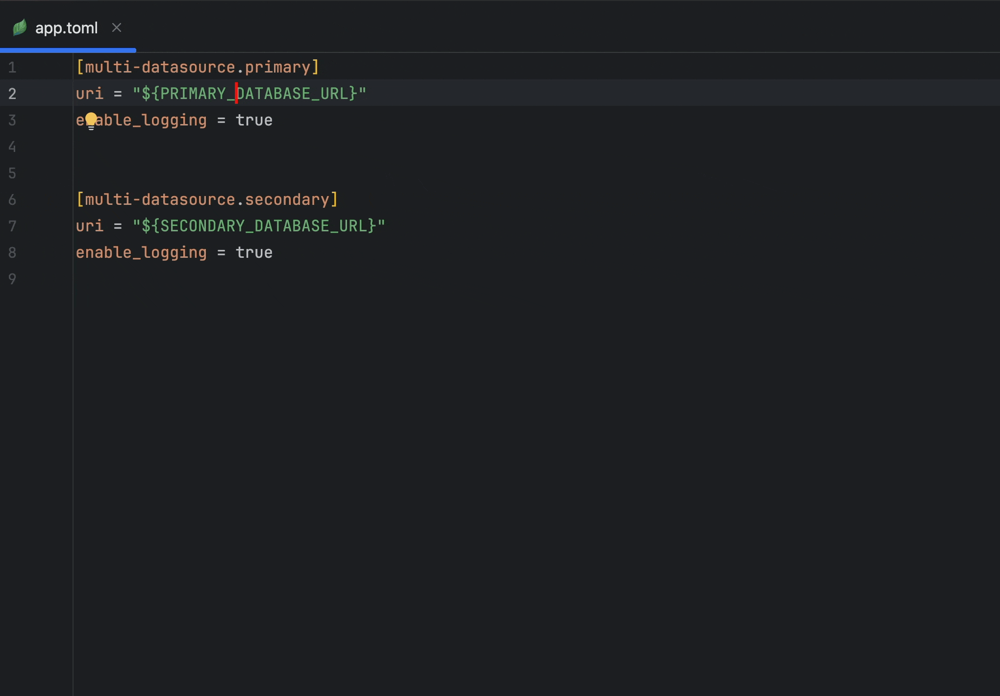

---

## Unified Tool Window

The spring-rs tool window (right sidebar) provides a unified view of all spring-rs items in your project.

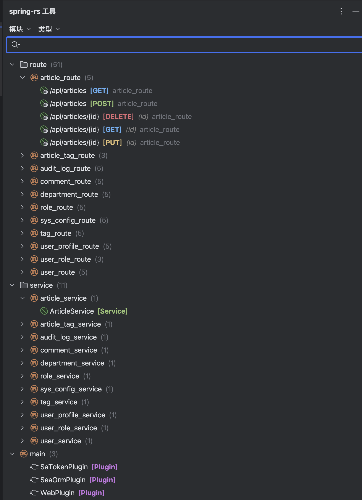

### Item Types

Switch between different item types using the **Type** dropdown:

| Type             | Description                                                        |
|------------------|--------------------------------------------------------------------|
| Endpoint         | HTTP routes (`#[get]`, `#[post]`, `Router::new().route()`)         |
| Job              | Scheduled tasks (`#[cron]`, `#[fix_delay]`, `#[fix_rate]`)         |
| Stream Listener  | Message stream handlers (`#[stream_listener("topic")]`)            |
| Component        | Services (`#[derive(Service)]`) with injection points              |
| Configuration    | Config structs with key-value tree (Rust defaults + TOML overrides)|
| Plugin           | Registered plugins (`App::new().add_plugin(XxxPlugin)`)            |

### Features

- **Tree View** — Items organized by crate > module > file
- **Module Filter** — Show items from specific crates only
- **Search** — Filter items by name, path, or expression
- **Double-click** — Navigate directly to the source code
- **Right-click Menu** — Copy path, jump to configuration, etc.

---

## Gutter Line Markers

Rich gutter icons on Rust functions and structs, providing at-a-glance information about spring-rs annotations.

### Route Markers


Color-coded HTTP method badges on handler functions. Supports both attribute macros (`#[get("/path")]`) and Router builder (`Router::new().route()`).


### Job Markers

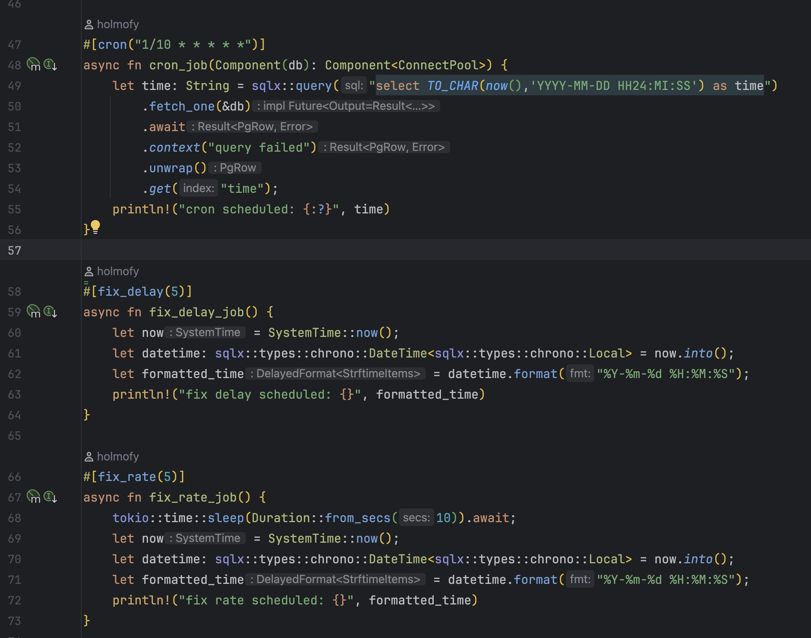

Clock icon on scheduled task functions. Hover to see the schedule expression:
- `#[cron("1/10 * * * * *")]` — Cron expression
- `#[fix_delay(10000)]` — Fixed delay in milliseconds
- `#[fix_rate(5000)]` — Fixed rate in milliseconds
- `#[one_shot(3000)]` — One-time execution after delay

### Stream Listener Markers

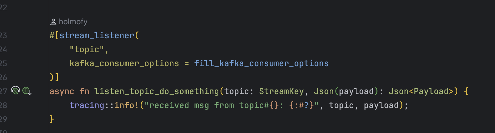

Listener icon on `#[stream_listener]` functions. Hover to see topics, consumer mode, and group ID.

### Cache Markers


Cache icon on `#[cache("key_pattern")]` functions. Hover to see key pattern, expire time, and condition.

### sa-token Security Markers

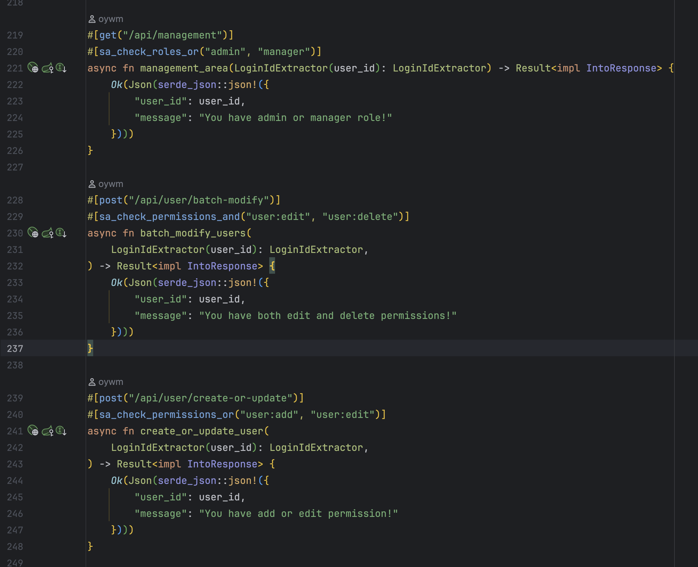

Security icon on authentication/authorization annotations:
- `#[sa_check_login]` — Login check
- `#[sa_check_role("admin")]` — Role check
- `#[sa_check_permission("user:delete")]` — Permission check
- `#[sa_check_roles_and(...)]` / `#[sa_check_roles_or(...)]` — Multiple roles
- `#[sa_check_permissions_and(...)]` / `#[sa_check_permissions_or(...)]` — Multiple permissions

### Socket.IO Markers

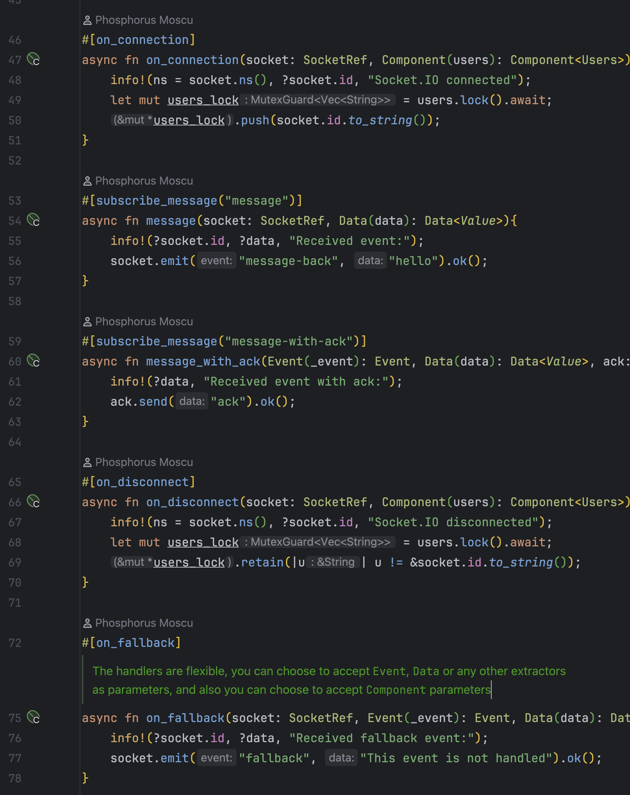

Web icon on Socket.IO event handlers:
- `#[on_connection]` — Connection handler
- `#[on_disconnect]` — Disconnect handler
- `#[subscribe_message("event")]` — Message subscription
- `#[on_fallback]` — Fallback handler

### Middleware Markers

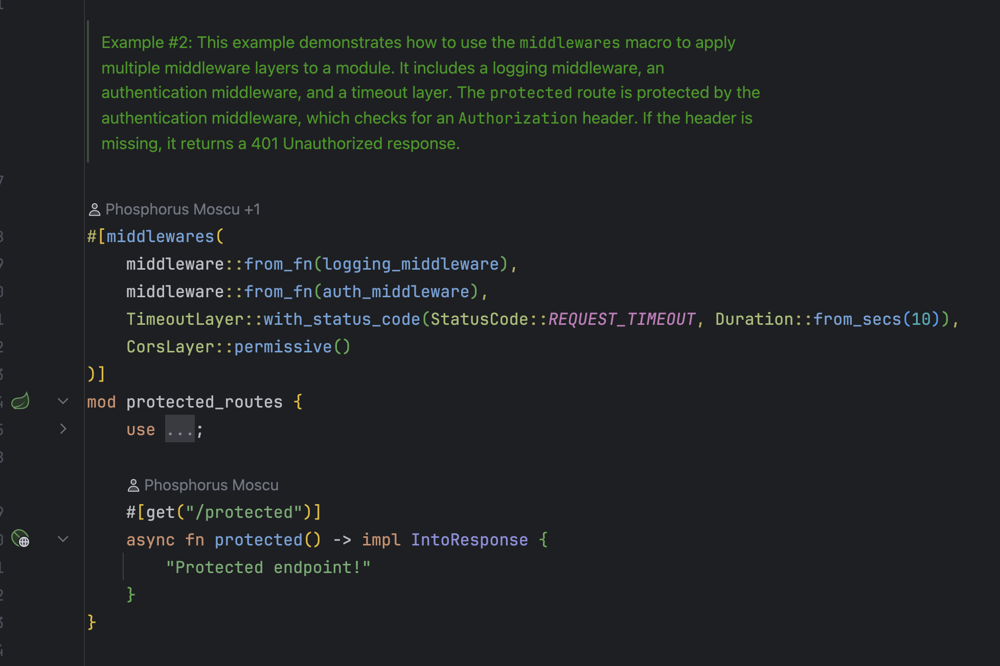

Middleware icon on `#[middlewares(mw1, mw2, ...)]` module attributes. Hover to see the middleware list.

### Service & Injection Markers


Gutter icons indicate spring-rs services and their injection points.


Visual indicators for `#[inject]` fields showing dependency relationships. Click to navigate between services and injection sites.

---

## Route Conflict Detection

The plugin detects duplicate route paths across all files within the same crate.

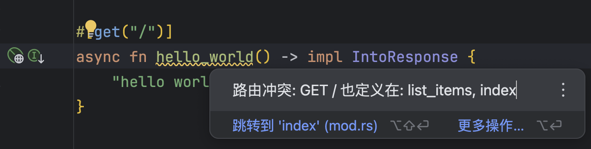

- Conflicts are highlighted with WARNING-level annotations
- Click the QuickFix to navigate directly to the conflicting handler function
- Detection respects crate boundaries — routes in different crates do not conflict

---

## `#[auto_config]` Completion

Auto-complete configurator types inside `#[auto_config(...)]` macros.

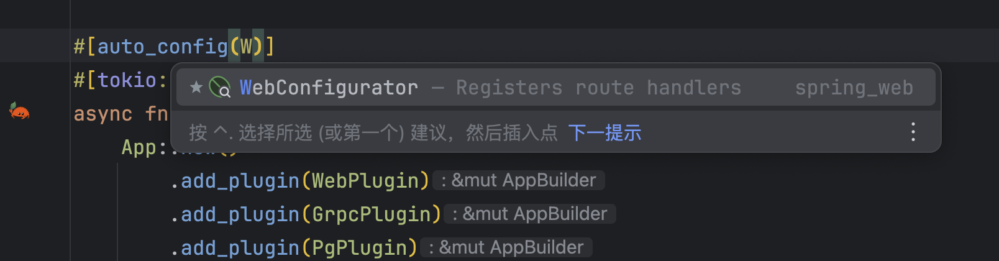

Supported configurators:
- `WebConfigurator` — Register HTTP route handlers (from `spring-web`)
- `JobConfigurator` — Register scheduled tasks (from `spring-job`)

---

## Dependency Injection Validation

Real-time validation for `#[inject(component)]` fields.

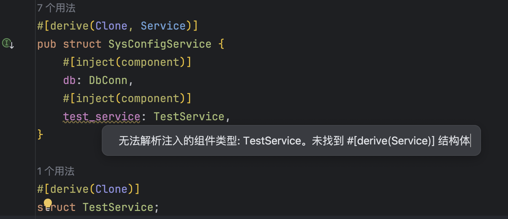

- Warns if the injected component type is not registered as a `#[derive(Service)]` in the project
- Built-in whitelist for framework-provided components: `DbConn`, `Redis`, `Postgres`, `Mailer`, `Op`, `Producer`, `Operator`

---

## New Project Wizard

Create new spring-rs projects with a guided wizard.

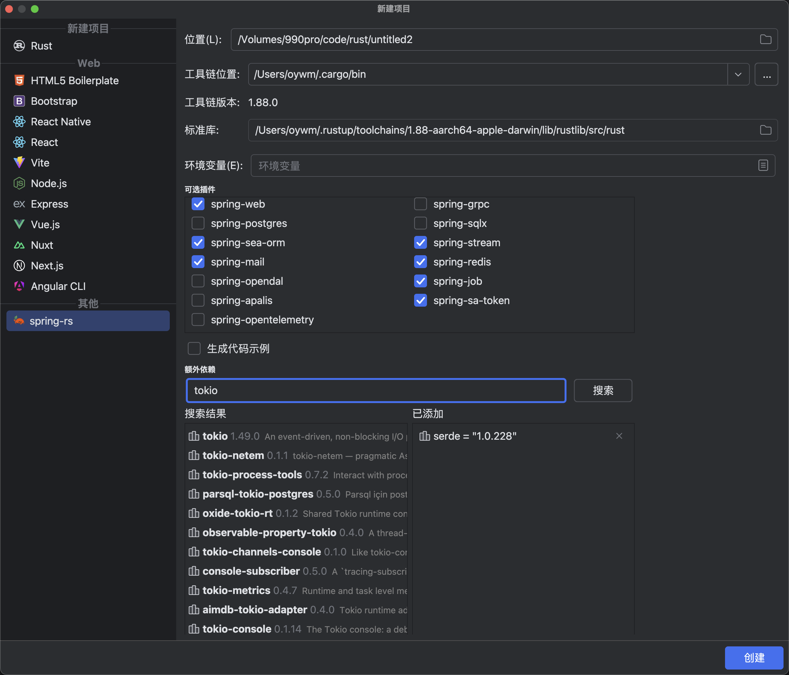

### Plugin Selection

Choose from 13 spring-rs plugins organized in a flat 2-column grid:

- **Web** — `spring-web` (HTTP server with Axum)
- **gRPC** — `spring-grpc` (gRPC server with Tonic)
- **PostgreSQL** — `spring-postgres` (native PostgreSQL)
- **SQLx** — `spring-sqlx` (async SQL with SQLx)
- **Sea-ORM** — `spring-sea-orm` (ORM with SeaORM)
- **Stream** — `spring-stream` (message streams)
- **Mail** — `spring-mail` (email via Lettre)
- **Redis** — `spring-redis` (Redis client)
- **OpenDAL** — `spring-opendal` (unified storage)
- **Job** — `spring-job` (cron scheduling with Tokio-cron)
- **Apalis** — `spring-apalis` (background job processing)
- **sa-token** — `spring-sa-token` (session/permission auth)
- **OpenTelemetry** — `spring-opentelemetry` (tracing/metrics)

### Extra Dependencies

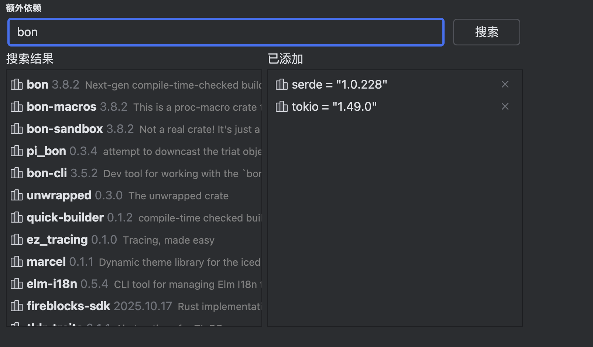

Search and add custom crate dependencies from crates.io:

- Left panel shows search results with pagination (auto-load on scroll)
- Right panel shows added dependencies
- All dependencies are deduplicated with plugin-provided crates in the generated `Cargo.toml`

### Example Code Generation

Optionally generate compilable example code for each selected plugin, based on official spring-rs examples.

---

## Sea-ORM Code Generation

Generate complete CRUD layers from database tables.

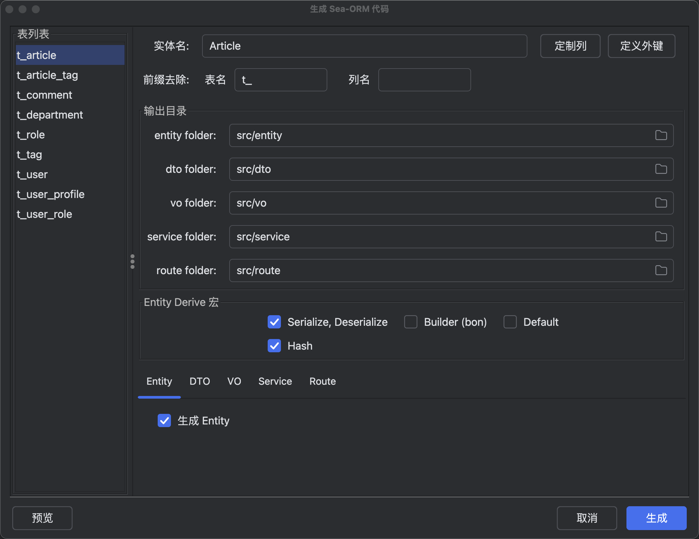

### How to Use

1. Open the **Database** tool window in your IDE
2. Select one or more tables
3. Right-click > **Generate Sea-ORM Code**
4. Configure output paths, table/column prefix stripping, and layer selection
5. Click **Preview** to review generated code, or **Generate** to write files directly

### Generated Layers

| Layer   | Description                                                                      |
|---------|----------------------------------------------------------------------------------|
| Entity  | `DeriveEntityModel` struct with column types, relations, and `prelude.rs` exports |
| DTO     | `CreateDto` + `UpdateDto` + `QueryDto` with `DeriveIntoActiveModel` and `IntoCondition` filter builder |
| VO      | View objects for API responses                                                    |
| Service | CRUD service with `#[derive(Service)]`, pagination, and condition-based queries   |
| Route   | Axum route handlers with RESTful CRUD endpoints                                   |

### Multi-Table Mode

When selecting multiple tables, the dialog shows a table list on the left panel. Click any table to configure it independently:

- **Entity Name** — Custom entity struct name per table
- **Layer Toggles** — Enable/disable Entity, DTO, VO, Service, Route per table
- **Output Directories** — Set different output folders per table
- **Derive Macros** — Configure Entity/DTO/VO derives independently per table
- **Route Prefix** — Custom route prefix per table

All per-table settings are persisted across sessions.

### Column Customization

Click **Customize Columns** to open the column editor for any table:

- **Include/Exclude** — Toggle columns via checkbox; excluded columns are skipped during generation
- **Override Rust Type** — Change the generated Rust type via editable dropdown (`String`, `i32`, `i64`, `DateTime`, `Uuid`, `Json`, `Decimal`, etc.)
- **Edit Comment** — Override column comments that appear in generated doc comments
- **Virtual Columns** — Add columns not in the database (displayed in green). Useful for computed fields or template-driven custom fields
- **Ext Properties** — Attach key-value metadata to any column, accessible in templates as `$column.ext.key`

### Foreign Key Definition

Click **Foreign Keys** to define logical foreign key relationships between tables:

- **Bidirectional View** — Shows all FKs involving the current table, both as source and as target
- **4-Column Layout** — Source Table / Source Column / Target Table / Target Column
- **Dynamic Dropdowns** — Column dropdowns auto-populate based on the selected table
- **Scoped to Selection** — Only tables selected for the current generation session are shown
- **Auto Reverse Relations** — During code generation, `BelongsTo` FKs automatically generate `HasMany` / `HasOne` reverse relations on the target entity

### Live Preview

Click **Preview** to see all generated files before writing to disk.

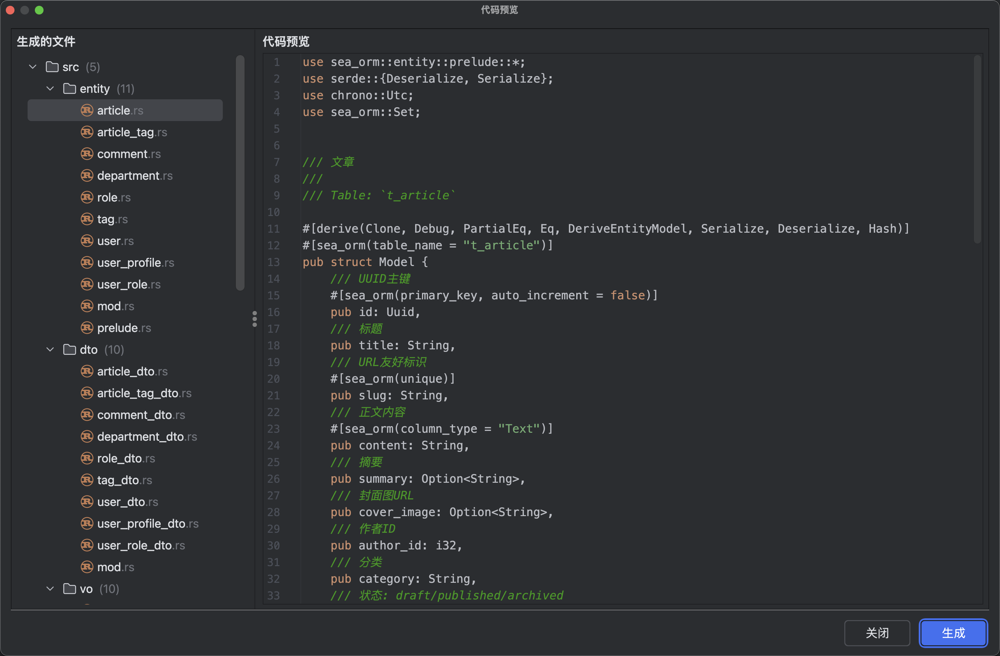

- Left panel: file tree showing all files to be generated
- Right panel: syntax-highlighted code preview
- Rename files before generation

### Features

- **Prefix Stripping** — Remove table/column prefixes (e.g., `sys_user` → `User`), takes effect immediately
- **Schema Support** — PostgreSQL non-public schemas generate correct module paths and imports
- **Smart `mod.rs` Merge** — Only appends new `mod` declarations; never removes existing ones
- **`prelude.rs` Generation** — Auto-generates entity re-exports for convenient imports
- **File Conflict Resolution** — Choose per-file: **Skip**, **Overwrite**, or **Backup & Overwrite**. `mod.rs` and `prelude.rs` are always incrementally merged
- **rustfmt Integration** — Optionally run `rustfmt` on all generated files (configurable in Settings)
- **Multi-Dialect** — PostgreSQL, MySQL, SQLite with dialect-specific type mapping
- **`$tool` / `$callback`** — Template utilities and output control:
  - `$tool.firstUpperCase(str)` / `$tool.firstLowerCase(str)` — Case conversion
  - `$tool.newHashSet()` — Create a HashSet for template-level deduplication
  - `$callback.setFileName(name)` — Override the output file name
  - `$callback.setSavePath(path)` — Override the output directory

### Settings

Configure code generation in **Settings** > **spring-rs** > **Code Generation**.

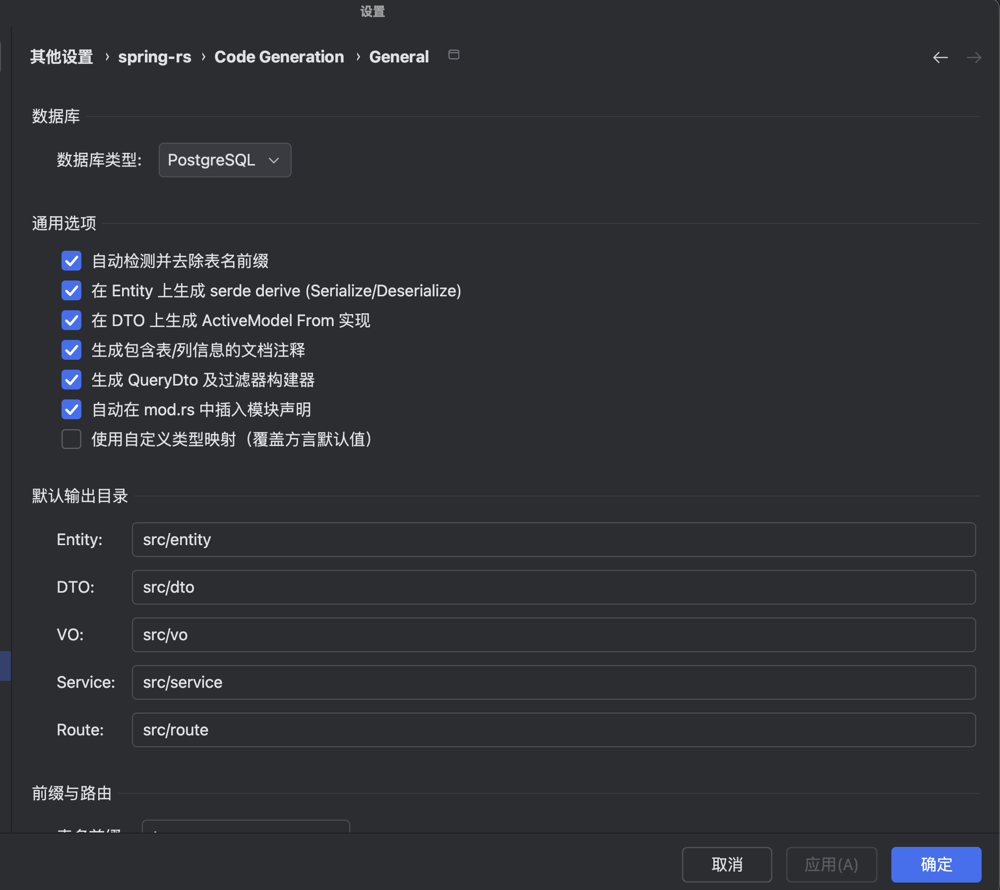

#### General

| Option | Description |
|--------|-------------|
| Database Type | Select MySQL, PostgreSQL, or SQLite |
| Auto-detect prefix | Automatically detect and strip table name prefixes |
| Table / Column Prefix | Manually specify prefixes to strip |
| Route Prefix | Default route path prefix for generated handlers |
| Generate serde | Add `Serialize` / `Deserialize` derives on Entity |
| Generate ActiveModel From | Add `DeriveIntoActiveModel` on DTO |
| Generate doc comments | Include table/column info in doc comments |
| Generate QueryDto | Generate `QueryDto` with `IntoCondition` filter builder |
| Auto-insert mod | Automatically add module declarations to `mod.rs` |
| Run rustfmt | Format generated files with `rustfmt` |
| Conflict Strategy | Default file conflict resolution: Skip / Overwrite / Backup |

#### Templates

- **Template Groups** — Create, copy, delete, import/export groups as JSON. The active group's templates are used during generation
- **Template Editor** — Edit Velocity templates with syntax highlighting. Available variables: `$table`, `$columns`, `$tool`, `$callback`, `$author`, `$date`, and all global variables
- **Global Variables** — Define key-value pairs (one per line) accessible as `$key` in all templates

#### Type Mapping

- **Mapping Groups** — Clone built-in groups or create custom ones per dialect
- **Regex Support** — Column type patterns support regex (e.g., `varchar(\(\d+\))?` matches `varchar`, `varchar(255)`)
- **Import/Export** — Share type mappings as JSON files
- **Reset to Defaults** — Restore dialect default mappings

---

## Run Configuration

### spring-rs Run Configuration

Dedicated run configuration type with spring-rs branding.


### Gutter Run Icon

Custom spring-rs icon on `main()` function for quick launch.


Right-click the gutter icon to:
- Run the application
- Debug the application
- Edit run configuration

---

## JSON to Rust Struct

Convert JSON to Rust struct definitions with proper serde attributes.

### How to Use

1. **Right-click in editor** > **JSON to Rust Struct**, or
2. **Generate menu** (**Alt+Insert** / **Cmd+N**) > **JSON to Rust Struct**


### Conversion Dialog

Paste your JSON and configure options:
- Struct name
- Derive macros (Serialize, Deserialize, Debug, Clone)
- Field visibility (pub)
- serde rename attributes


### Features

- Nested objects become nested structs
- Arrays become `Vec<T>`
- Null values become `Option<T>`
- camelCase automatically converts to snake_case with serde rename
- Mixed types become `serde_json::Value`

---

## Custom File Icons

### Config File Icons

spring-rs configuration files (`app.toml`, `app-*.toml`) display a custom leaf icon.


---

## Configuration

The plugin automatically detects spring-rs projects by checking for spring-related dependencies in `Cargo.toml`:

```toml
[dependencies]
spring = "0.4"
spring-web = "0.4"
spring-sqlx = "0.4"
```

No additional configuration is required.

---

## Building from Source

```bash
# Clone the repository
git clone https://github.com/spring-rs/spring-rs-plugin.git
cd spring-rs-plugin

# Build the plugin
./gradlew buildPlugin

# Run IDE with the plugin (for testing)
./gradlew runIde

# Run tests
./gradlew test
```

### Multi-Platform Build

Build for different IDE versions:

```bash
# RustRover 2025.1+ (default)
./gradlew -PplatformVersion=251 buildPlugin

# IntelliJ IDEA 2024.1
./gradlew -PplatformVersion=241 buildPlugin

# IntelliJ IDEA 2023.3
./gradlew -PplatformVersion=233 buildPlugin
```

The built plugin ZIP is located at `build/distributions/`.

---

## Contributing

Contributions are welcome! Please feel free to submit a Pull Request.

1. Fork the repository
2. Create your feature branch (`git checkout -b feature/amazing-feature`)
3. Commit your changes (`git commit -m 'Add some amazing feature'`)
4. Push to the branch (`git push origin feature/amazing-feature`)
5. Open a Pull Request

---

## Related Links

- [spring-rs Framework](https://github.com/spring-rs/spring-rs)
- [spring-rs Documentation](https://spring-rs.github.io/)
- [JetBrains Plugin Repository](https://plugins.jetbrains.com/)

---

## License

This project is licensed under the MIT License - see the [LICENSE](LICENSE) file for details.

---

## Sponsor

If this plugin is helpful to you, please consider supporting me:

<div align="center">
  <table>
    <tr>
      <td align="center"><b>WeChat</b></td>
      <td align="center"><b>Alipay</b></td>
    </tr>
    <tr>
      <td></td>
      <td></td>
    </tr>
  </table>
</div>
