<div align="center">
  
</div>

<h1 align="center">spring-rs Plugin for RustRover</h1>

<div align="center">
  为 <a href="https://github.com/spring-rs/spring-rs">spring-rs</a> 框架提供的 IDE 支持 — 一个用 Rust 编写的应用框架，灵感来自 Java 的 SpringBoot
</div>

<div align="center">
  <a href="README.md">English</a> ｜ <b>中文</b>
</div>

<div align="center">
  <a href="https://plugins.jetbrains.com/"></a>
  <a href="LICENSE"></a>
</div>


## 功能特性

- **TOML 配置支持** - 为 `app.toml` 配置文件提供智能补全、验证、导航和文档
- **路由工具** - 可视化工具窗口，用于浏览和搜索 HTTP 路由
- **运行配置** - 专用的 spring-rs 运行配置，带有自定义图标
- **JSON 转 Rust 结构体** - 将 JSON 转换为带有 serde 属性的 Rust 结构体定义
- **自定义图标** - 为配置文件和入口点提供 spring-rs 主题图标

## 系统要求

- RustRover 2025.2+ 或安装了 Rust 插件的 IntelliJ IDEA 2023.3+
- 使用 `spring-rs` 依赖的 Rust 项目

## 安装方法

1. 打开 IDE，进入 **Settings/Preferences** > **Plugins**
2. 点击 **Marketplace** 并搜索 "spring-rs"
3. 点击 **Install** 并重启 IDE

或手动安装：
1. 从 [Releases](https://github.com/spring-rs/spring-rs-plugin/releases) 下载插件 ZIP 文件
2. 进入 **Settings/Preferences** > **Plugins** > **齿轮图标** > **Install Plugin from Disk...**
3. 选择下载的 ZIP 文件

---

## TOML 配置支持

本插件为 spring-rs 配置文件（`app.toml`、`app-dev.toml`、`app-prod.toml` 等）提供全面的 IDE 支持。

### 智能补全

基于带有 `#[derive(Configurable)]` `#[config_prefix = "xxx"]`注解的 Rust 结构体定义，自动补全 section 名称、键和值。


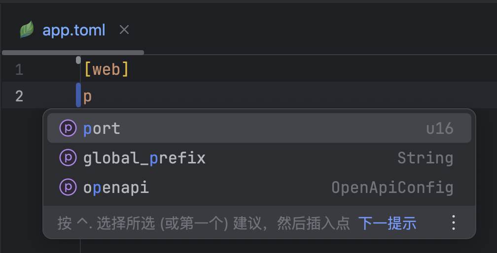

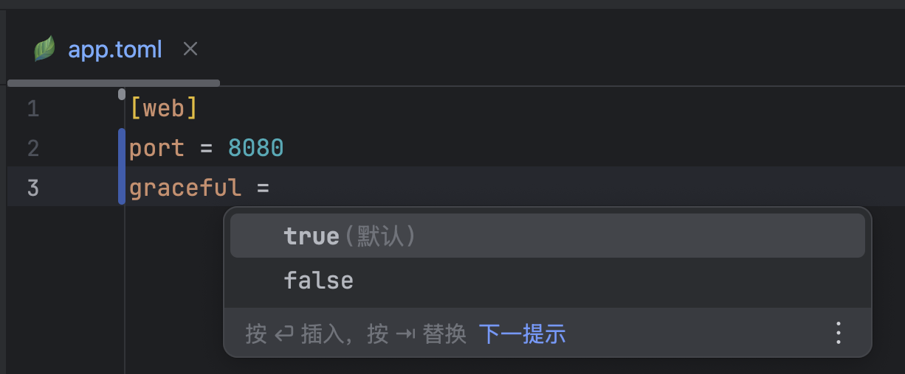

### 枚举值补全

枚举字段会显示 Rust 枚举定义中的所有可用变体。

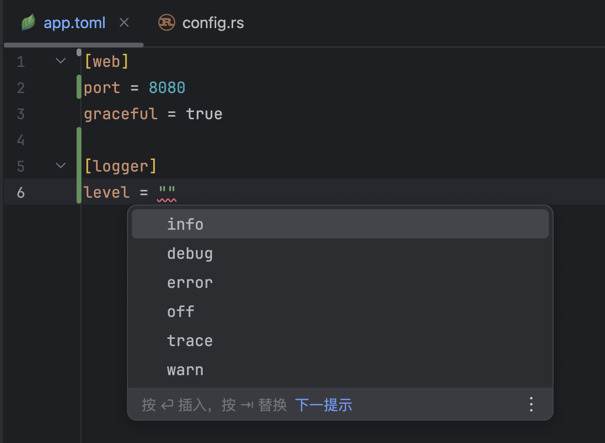

### 导航

**Ctrl+Click**（macOS 上为 **Cmd+Click**）任意 TOML 键或 section，可直接跳转到对应的 Rust 结构体字段。

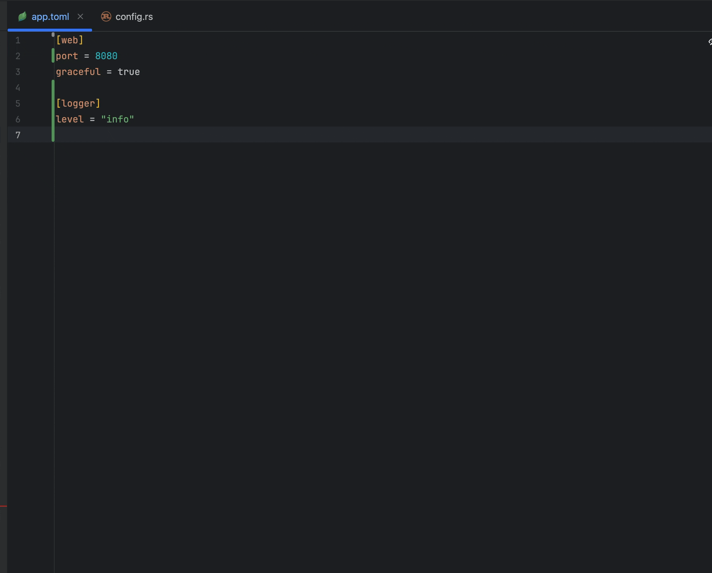

### 验证

实时检查：
- 未知的 section
- 未知的键
- 类型不匹配（例如，期望整数却提供了字符串）
- 无效的枚举值

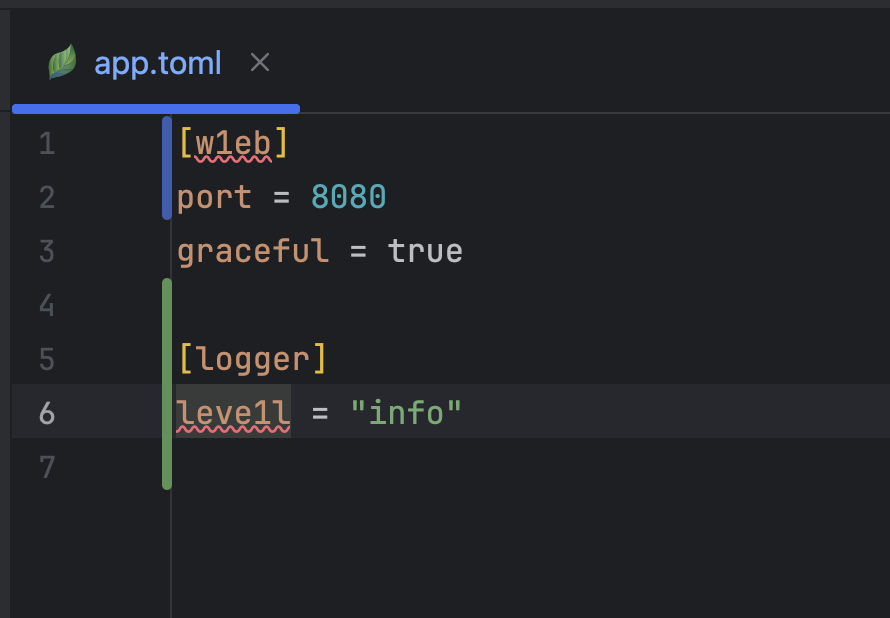

常见问题提供快速修复：
- 添加/移除引号
- 将值包装为数组
- 转换为内联表

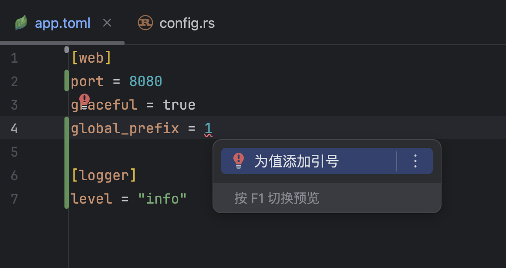

### 文档

将鼠标悬停在任意 TOML 键或 section 上（**Ctrl+Q** / **F1**）可查看：
- 字段类型
- 默认值
- Rust 源码中的文档注释
- 可用的枚举值

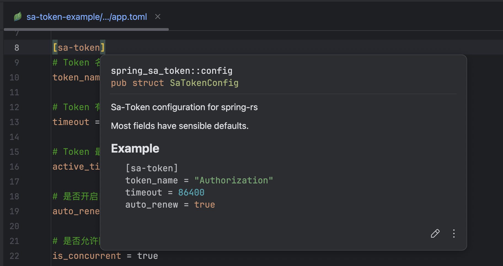

---

## 路由浏览器

### 路由工具窗口

专用面板列出项目中的所有 HTTP 路由，按模块和文件分组。


功能：
- **树状视图** - 路由按 crate > 模块 > 文件 组织
- **彩色方法标签** - GET（绿色）、POST（蓝色）、PUT（橙色）、DELETE（红色）、PATCH（紫色）
- **搜索** - 按路径、方法或处理函数名称过滤路由
- **模块过滤** - 仅显示特定 crate 的路由
- **双击** - 直接导航到处理函数

### 路由边栏图标

处理函数上的边栏图标显示 HTTP 方法和路径。

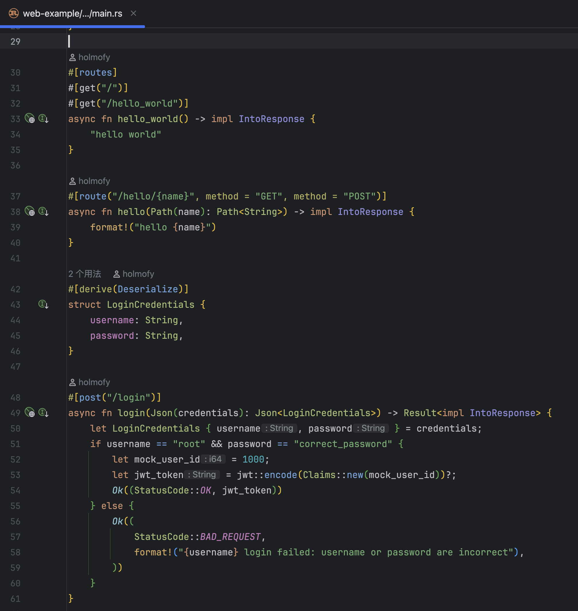

支持：
- **属性宏**：`#[get("/path")]`、`#[post("/path")]`、`#[route("/path", method = "GET")]`
- **Router 构建器**：`Router::new().route("/path", get(handler))`

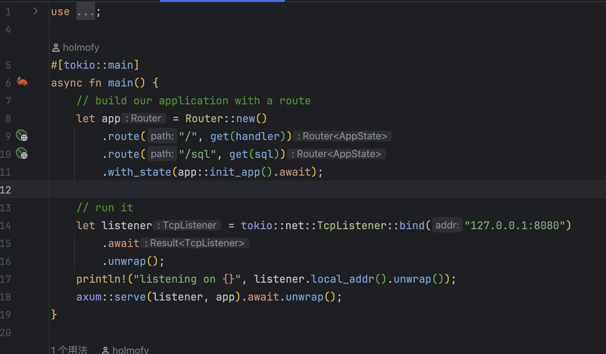

---

## 运行配置

### spring-rs 运行配置

带有 spring-rs 品牌标识的专用运行配置类型。

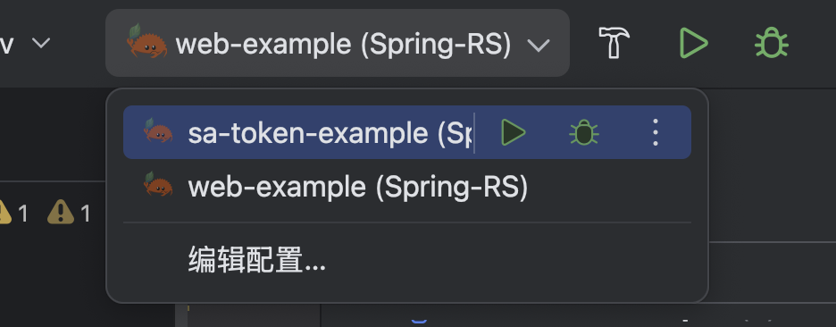

### 边栏运行图标

`main()` 函数上的自定义 spring-rs 图标，用于快速启动。

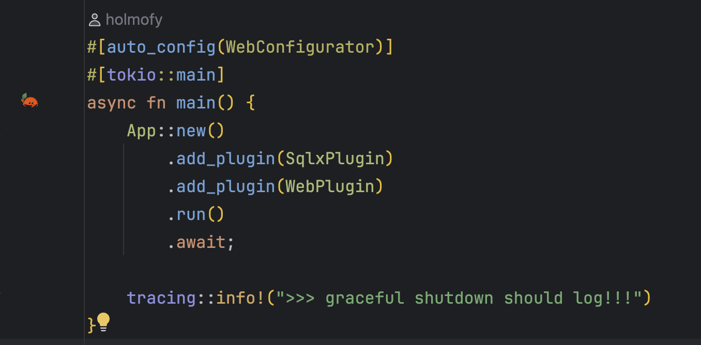

右键点击边栏图标可：
- 运行应用
- 调试应用
- 编辑运行配置

---

## JSON 转 Rust 结构体

将 JSON 转换为带有正确 serde 属性的 Rust 结构体定义。

### 使用方法

1. **在编辑器中右键** > **JSON to Rust Struct**，或
2. **Generate 菜单**（**Alt+Insert** / **Cmd+N**）> **JSON to Rust Struct**


### 转换对话框

粘贴 JSON 并配置选项：
- 结构体名称
- Derive 宏（Serialize、Deserialize、Debug、Clone）
- 字段可见性（pub）
- serde rename 属性

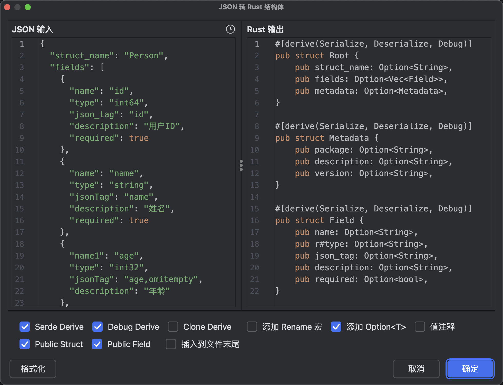

### 功能特点

- 嵌套对象转换为嵌套结构体
- 数组转换为 `Vec<T>`
- null 值转换为 `Option<T>`
- camelCase 自动转换为 snake_case 并添加 serde rename
- 混合类型转换为 `serde_json::Value`

---

## 自定义文件图标

### 配置文件图标

spring-rs 配置文件（`app.toml`、`app-*.toml`）显示自定义叶子图标。

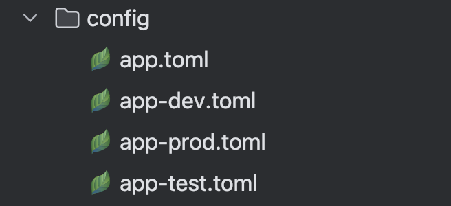

---

## 服务和注入标记

### 服务标记

边栏图标指示 spring-rs 服务及其注入点。

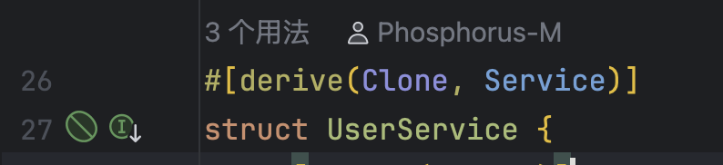

### 注入标记

`#[inject]` 字段的可视化指示器，显示依赖关系。

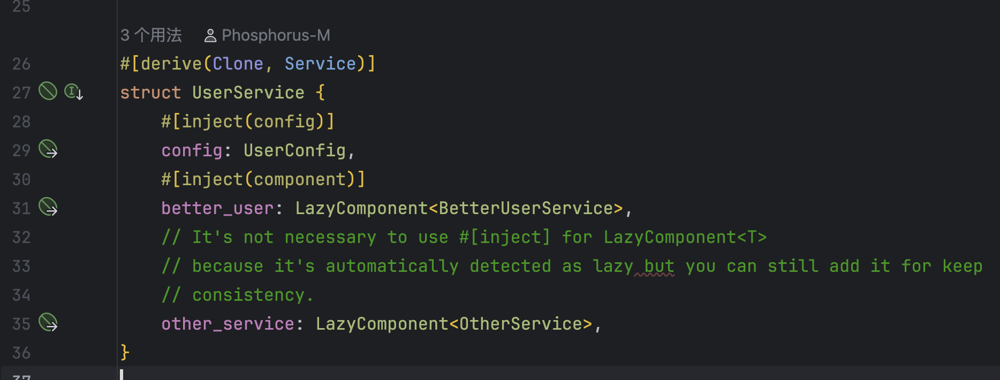

点击图标可在服务和注入位置之间导航。

---

## 配置

插件通过检查 `Cargo.toml` 中的 spring 相关依赖自动检测 spring-rs 项目：

```toml
[dependencies]
spring = "0.4"
spring-web = "0.4"
spring-sqlx = "0.4"
```

无需额外配置。

---

## 从源码构建

```bash
# 克隆仓库
git clone https://github.com/spring-rs/spring-rs-plugin.git
cd spring-rs-plugin

# 构建插件
./gradlew buildPlugin

# 运行带有插件的 IDE（用于测试）
./gradlew runIde

# 运行测试
./gradlew test
```

### 多平台构建

为不同 IDE 版本构建：

```bash
# RustRover 2025.2（默认）
./gradlew -PplatformVersion=252 buildPlugin

# IntelliJ IDEA 2024.1
./gradlew -PplatformVersion=241 buildPlugin

# IntelliJ IDEA 2023.3
./gradlew -PplatformVersion=233 buildPlugin
```

构建的插件 ZIP 文件位于 `build/distributions/`。

---

## 贡献

欢迎贡献！请随时提交 Pull Request。

1. Fork 仓库
2. 创建功能分支（`git checkout -b feature/amazing-feature`）
3. 提交更改（`git commit -m 'Add some amazing feature'`）
4. 推送到分支（`git push origin feature/amazing-feature`）
5. 创建 Pull Request

---

## 相关链接

- [spring-rs 框架](https://github.com/spring-rs/spring-rs)
- [spring-rs 文档](https://spring-rs.github.io/)
- [JetBrains 插件仓库](https://plugins.jetbrains.com/)

---

## 许可证

本项目采用 MIT 许可证 - 详见 [LICENSE](LICENSE) 文件。

---

## 赞助

如果这个插件对你有帮助，欢迎请我喝杯咖啡：

<div align="center">
  <table>
    <tr>
      <td align="center"><b>微信</b></td>
      <td align="center"><b>支付宝</b></td>
    </tr>
    <tr>
      <td></td>
      <td></td>
    </tr>
  </table>
</div>
